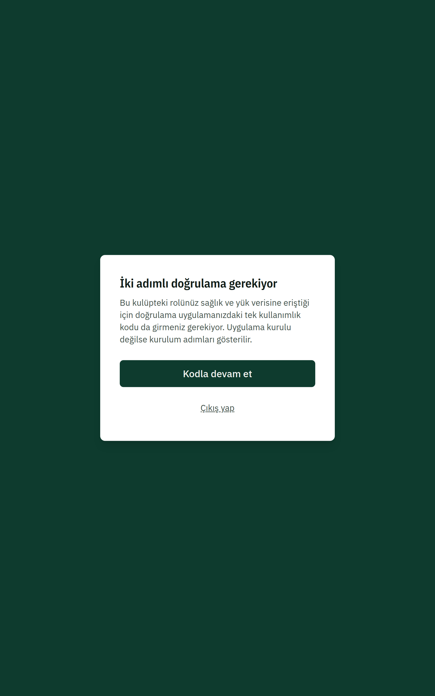
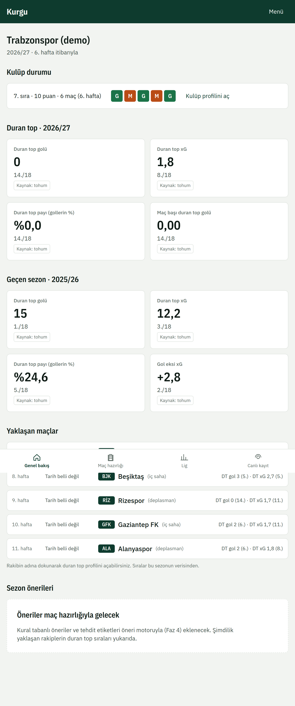

# 1. Başlarken

## Giriş
1. Kulübünüzün Kurgu adresini açın ve **Giriş yap**'a basın.
2. Kullanıcı adınızı ve parolanızı girin. İlk girişte geçici parolanızı değiştirmeniz istenir.
3. Yönetici, sağlık ya da performans rolündeyseniz **İki adımlı doğrulama gerekiyor** ekranı çıkar. **Kodla devam et**'e basın; doğrulama uygulamanız (Google Authenticator, Microsoft Authenticator vb.) kurulu değilse ekrandaki karekodu okutun, sonra 6 haneli kodu girin.

Beş kez hatalı parola girilirse hesap kısa süreliğine kilitlenir (1 dakikadan başlar, en çok 15 dakika). Telefonunuzu kaybettiyseniz kulüp yöneticinize başvurun.

## Ekran düzeni
- **Tablet ve masaüstü:** solda koyu yeşil menü. Amber işaret "sizin kulübünüz" anlamına gelir.
- **Telefon:** altta sekmeler, diğer sayfalar çekmece menüde.
- Menüde yalnız rolünüzün açabildiği sayfalar görünür.

## Rozetler ve işaretler
| İşaret | Anlamı |
|---|---|
| **Örnek veri** | Demo kaydıdır; gerçek maçtan gelmez. |
| **Az veri** | Örneklem küçük (8'den az deneme ya da 5'ten az maç). Değer lig ortalamasına doğru çekilmiştir; karar verirken temkinli olun. |
| **Dolaylı** | Hava topu, faul ve uzaklaştırma gibi savunmayı yalnız dolaylı anlatan göstergeler. |
| **Kaynak: kulüp kaydı** | Değer kulübünüzün içe aktardığı veriden gelir; lisanslı veriyi geçersiz kılar. |
| G / B / M | Galibiyet, beraberlik, mağlubiyet (renge ek olarak harfle). |

Sıralarda **1 en yüksek değerdir**; eşit değerler aynı sırayı alır. Penaltılar duran top metriklerine dahil değildir.

## Dil ve tema
Sayfanın altındaki seçiciyle Türkçe ve İngilizce arasında geçebilirsiniz. Koyu tema cihazınızın ayarını izler.

## Profilim
**Profilim** sayfası e-postanızı, rollerinizi ve kulüp üyeliklerinizi gösterir. Birden çok kulüpte üyeyseniz çalışacağınız kulübü buradan **Seç**ersiniz.
