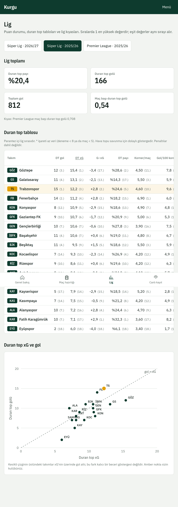
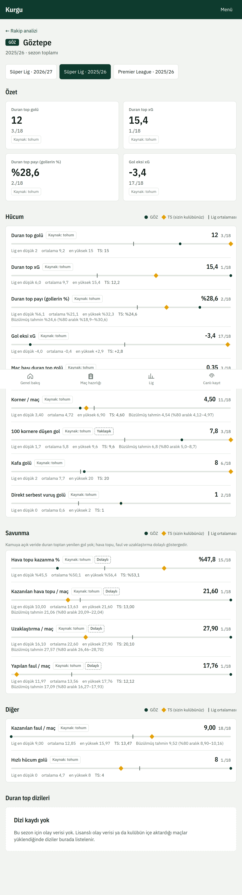
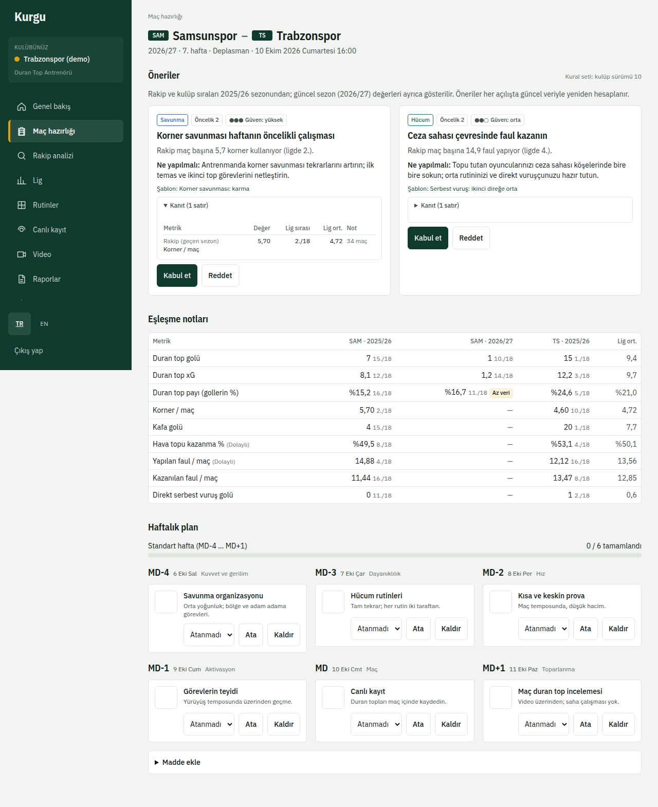
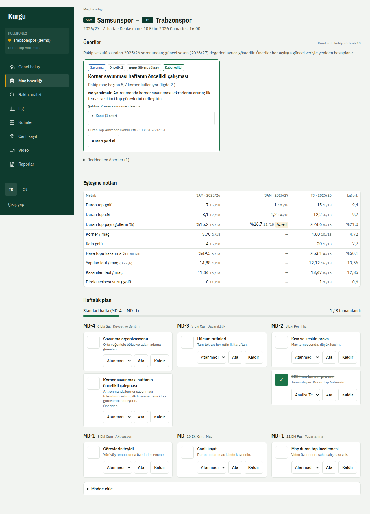

# 2. Analiz ve maç hazırlığı

## Lig
**Lig** sayfası puan durumunu ve duran top tablolarını gösterir: kullanılan duran top, şut, gol, xG ve lig kıyasları. Sezonu sayfanın üstünden değiştirebilirsiniz.

## Rakip analizi
**Rakip analizi**'nde bir takım seçin. Profil; hücum ve savunma metriklerini, lig sırasını, bölgelere göre teslim dağılımını ve son duran top dizilerini gösterir. "Az veri" rozetli metrikleri tek başına karar gerekçesi yapmayın.

Metriklerin tanımı, birimi ve kaynağı **Metodoloji** sayfasındadır.

## Maç hazırlığı
**Maç hazırlığı** sıradaki maçları ve her maç için öneri sayısını, öne çıkan tehditleri listeler. Bir maçı açın.

### Öneriler
Öneriler kulübünüzün kural setinden üretilir. Her kartta öneri, gerekçe (hangi sayılar), güven düzeyi, ilgili şablon ya da rutin bulunur.
- **Kabul et**: öneri haftalık plana eklenebilir.
- **Reddet**: kısa bir gerekçe yazın. Reddedilenler ayrı listede durur; karar geri alınabilir.

### Haftalık plan
Plan yoksa şablon seçip **Planı oluştur**'a basın: **Standart hafta** (MD-4 … MD+1) ya da **Sıkışık hafta** (MD-2 … MD+1). Kabul edilen öneriler plana madde olarak gelir. Maddelere sorumlu atayın, yapıldıkça tamamlandı işaretleyin; ilerleme üstte görünür.

### Maç sonrası geri bildirim
Maç günü canlı kayıt yapıldıysa hazırlık sayfası kabul edilen önerilerin yanında maçtaki ilgili kayıtları gösterir; böylece planın sahada nasıl sonuç verdiğini görürsünüz.

