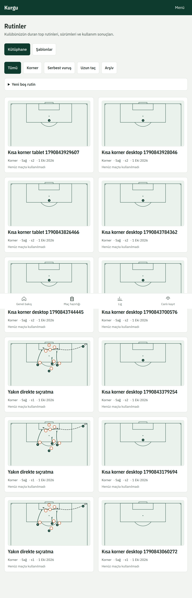
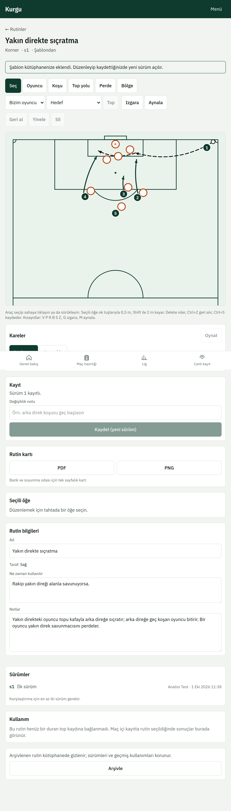
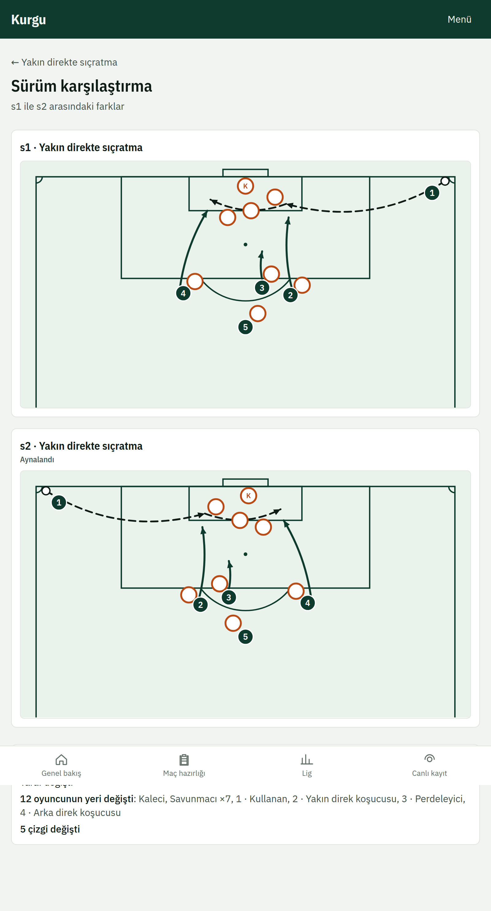
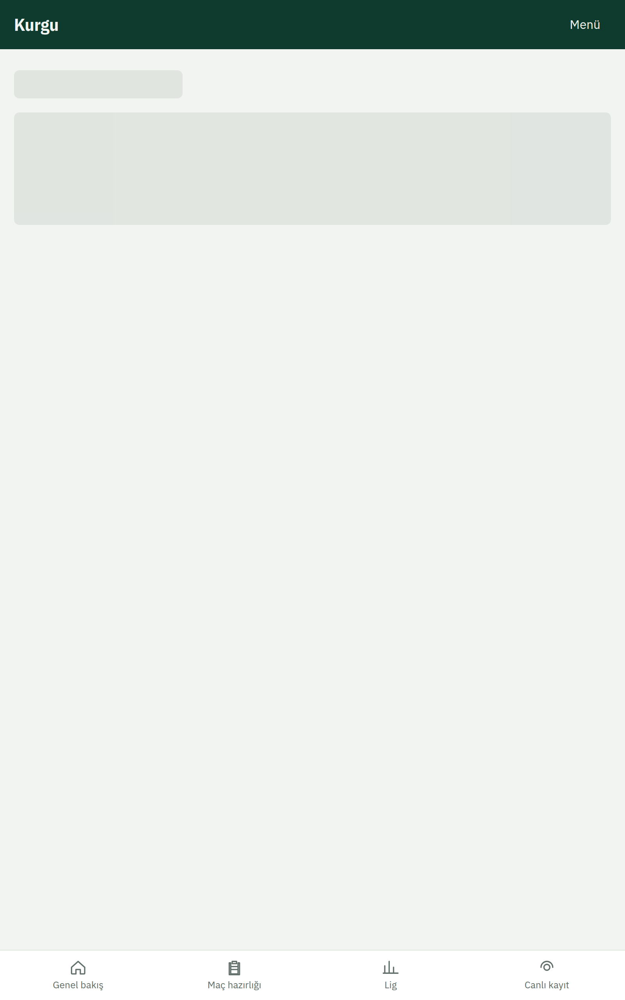

# 3. Rutinler

**Rutinler** kulübünüzün duran top kütüphanesidir. Her rutin sürümlüdür: kaydettiğiniz her değişiklik yeni bir sürüm olur, eski sürümler silinmez.

## Yeni rutin
1. **Şablonlar**'dan bir başlangıç seçin (ör. yakın direğe koşu, kısa korner).
2. Editörde oyuncuları sürükleyin, koşu ve top yollarını çizin, bölgeleri vurgulayın. **Geri al** son değişikliği geri alır.
3. Bir değişiklik notu yazıp **Kaydet (yeni sürüm)**'e basın.

Aynı rutini başka biri sizden önce kaydettiyse uyarı çıkar: **Güncel sürümü aç** ile onun sürümünü görün ya da bilerek **Yine de benimkini kaydet**.

## Sürümler ve karşılaştırma
**Sürümler** listesinden eski bir sürümü açabilir, iki sürümü **karşılaştırabilir** ya da eski bir sürümü geri yükleyebilirsiniz (geri yükleme de yeni sürüm olarak kaydedilir).

## Rutin kartı
**Rutin kartı** bölümünden bank ve soyunma odası için tek sayfalık PDF ya da PNG indirin. İndirmeden önce değişiklikleri kaydedin.

## Rutinin sahadaki sonucu
Canlı kayıtta rutin seçilen duran toplar rutinin kullanım, şut ve gol sayılarına eklenir; videodan bağlanan klipler rutin sayfasında görünür.

