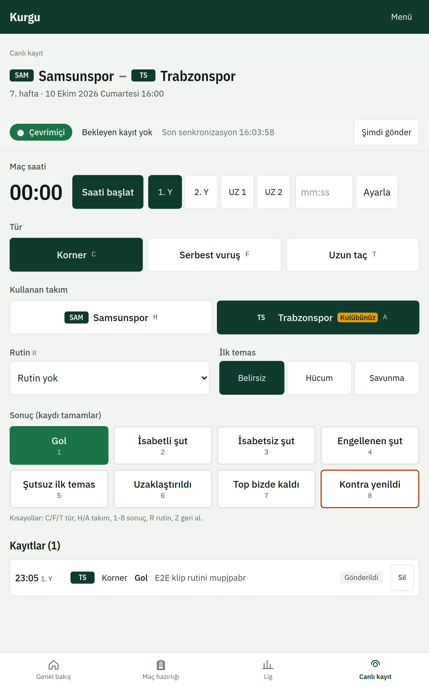
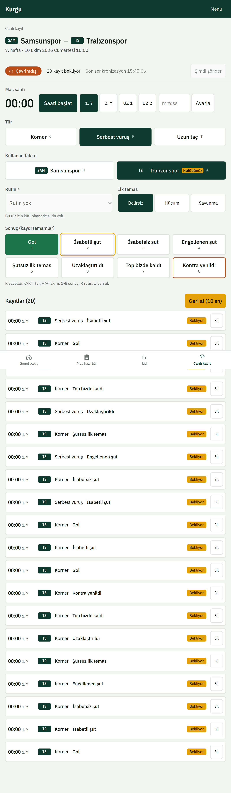
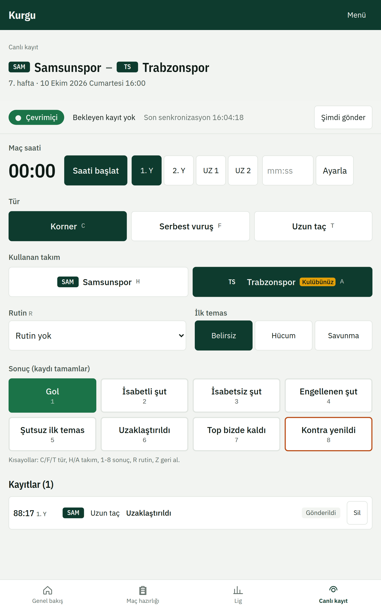
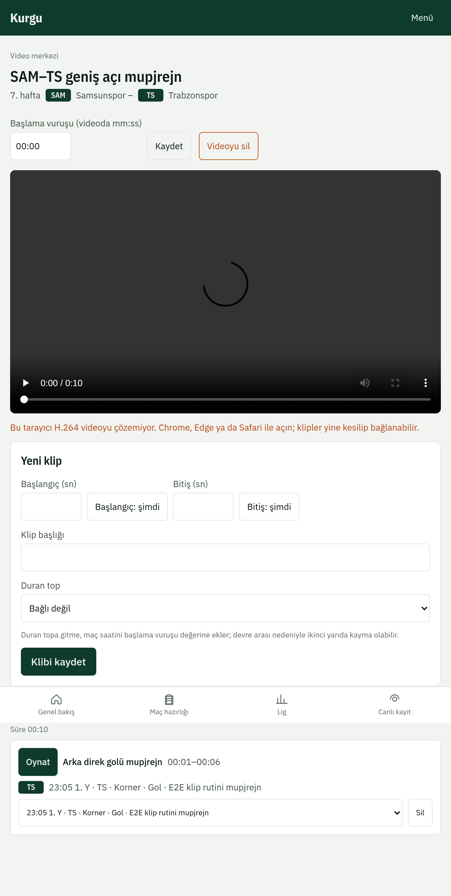
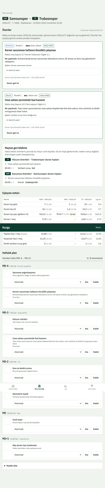

# 4. Maç günü: canlı kayıt ve video

## Canlı kayıt
**Canlı kayıt** (`/live`) maç sırasında duran topları kaydetmek içindir. Tablette yatay kullanım önerilir. Fikstürü seçip **Saati başlat**'a basın.

Her duran top birkaç dokunuşla kaydedilir: tür, takım, sonuç ve isterseniz rutin. Klavyeli cihazlarda kısayollar:

| Tuş | İşlev |
|---|---|
| C / F / T | Korner, serbest vuruş, uzun taç |
| H / A | Ev sahibi / deplasman |
| 1-8 | Sonuç |
| R | Rutin seç |
| Z | Son kaydı geri al |

Son kayıt birkaç saniye boyunca **Geri al** düğmesiyle silinebilir.

### İnternet kesilirse
Kayıt çevrimdışı da sürer. Üst çubuk **Çevrimdışı** gösterir ve kayıtlar cihazda bekler; bağlantı gelince kendiliğinden gönderilir. Beklemek istemezseniz **Şimdi gönder**'e basın.

İkinci bir cihaz aynı maçı açarsa kayıtlar iki cihazda da görünür; aynı kayıt iki kez sayılmaz.

## Video ve klipler
**Video** (`/video`) bölümünde **Video yükle** ile maç kaydını seçip **Yüklemeyi başlat**'a basın. Durum sırasıyla **Yükleniyor**, **Dönüştürülüyor** ve **Hazır** olur; büyük dosyalarda dönüştürme birkaç dakika sürebilir.

Video hazır olunca **Yeni klip** ile başlangıç ve bitişi işaretleyin, klibi bir duran top kaydına ya da rutine bağlayıp **Klibi kaydet**'e basın.

## Maç sonrası geri bildirim
Maç hazırlığı sayfasında, kabul ettiğiniz önerilerin sahada nasıl sonuçlandığı canlı kayıttan otomatik olarak eşleşir.

