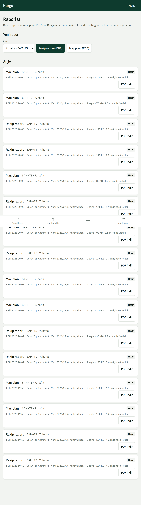
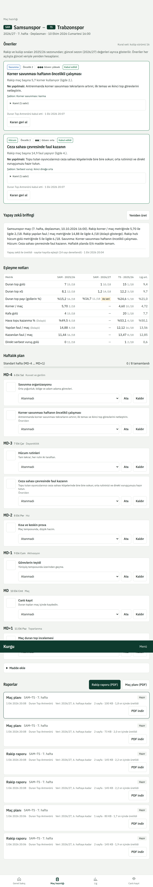
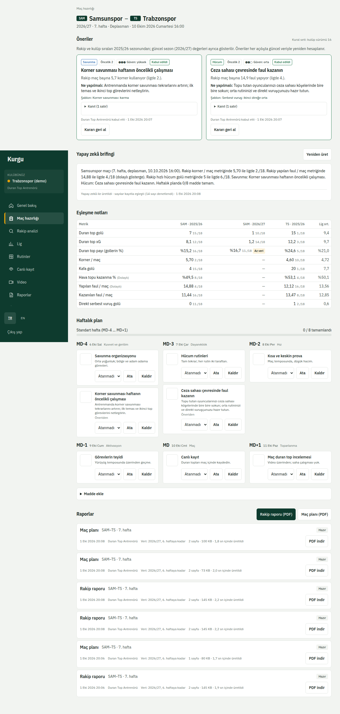

# 5. Raporlar ve brifing

## PDF raporlar
**Raporlar** (`/reports`) sayfasında **Yeni rapor** ile rapor türünü ve maçı seçin:

- **Rakip raporu (PDF)**: rakibin duran top profili, bölgeler ve tehdit oyuncuları.
- **Maç planı (PDF)**: kabul edilen öneriler ve MD planı.

Rapor arka planda hazırlanır; ilerleme listede görünür ve bittiğinde **İndir** etkin olur. Eski raporlar arşivde kalır.

Aynı düğmeler maç hazırlığı sayfasında da vardır.

## Yapay zekâ brifingi
Maç hazırlığı sayfasındaki **Yapay zekâ brifingi** panelinde **Brifing üret**'e basın. Brifing yalnızca ekrandaki verilerden yazılır: metindeki her sayı kayıtlı verilerle denetlenir, tutmayan bir sayı varsa brifing reddedilir ve gösterilmez.

Brifing özelliği yönetici tarafından **Yönetim → Yapay zekâ brifingi** sayfasından açılır (bkz. [Yönetim](08-yonetim.md)). Kapalıysa panel bunu söyler.
