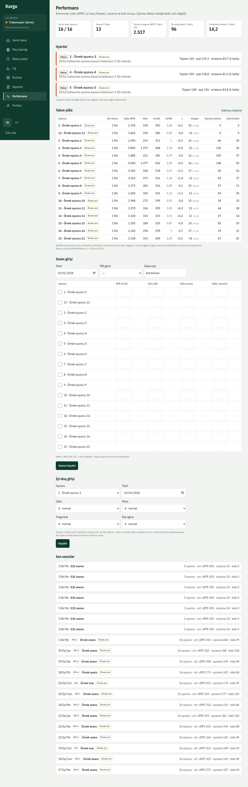
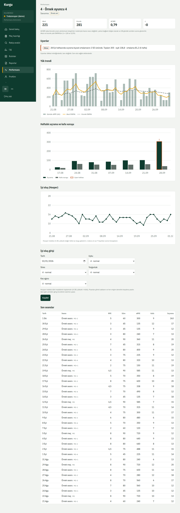
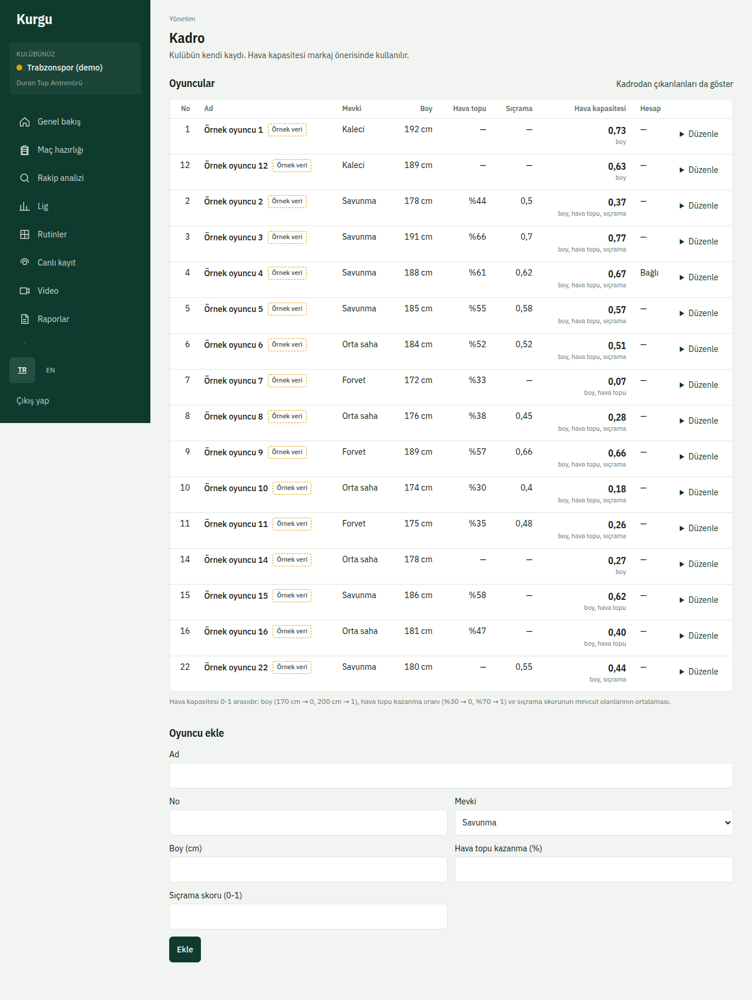
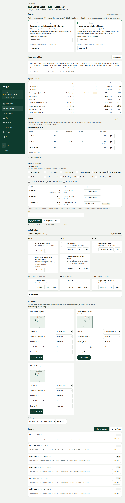
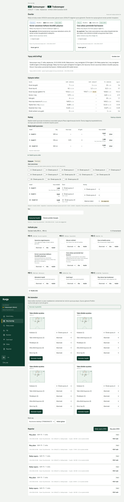

# 6. Performans, kadro ve markaj

## Takım yükü
**Performans** (`/performance`) sayfası takımın antrenman yükünü, akut/kronik oranı ve uyarıları gösterir. Bu sayfayı yalnızca performans ve sağlık ekibi ile yetkili antrenörler görür.

- **Seans girişi**: tarih, süre ve oyuncu başına RPE girip **Seansı kaydet**.
- **İyi oluş girişi**: uyku, stres, yorgunluk ve kas ağrısı puanları. Oyuncunun rızası yoksa sistem girişi kabul etmez ("Bu oyuncu için iyi oluş rızası yok.").

Oyuncu sayfasında (`/performance/players/{id}`) haftalık yük ve iyi oluş grafikleri bulunur. İyi oluş puanları şifreli saklanır ve her görüntüleme denetim kaydına yazılır.

Oyuncunun rıza durumu ve veri talepleri de bu sayfadadır; ıslak imzalı form için **Islak imzalı rızayı kaydet** kullanılır.

## Kadro
**Yönetim → Kadro** (`/admin/squad`) sayfasında oyuncu ekleyip forma numarası, mevki ve boy bilgisini güncellersiniz. Bu yetki yalnız kadro düzenleme izni olan kullanıcılardadır.

## Markaj ve rol atama
Maç hazırlığı sayfasında iki bölüm vardır:

- **Markaj**: rakibin hava tehdidi olan oyuncularını kendi oyuncularınızla eşleştirip **Eşleşmeyi kaydet**. Boy farkı ve hava topu göstergeleri yanında görünür (hava topu savunma için "dolaylı" göstergedir).
- **Rol atama**: kabul edilen rutinlerde her role oyuncu seçip **Atamaları kaydet**.

Atanan oyuncular görevlerini **Profilim** sayfasındaki **Görev kartlarım** bölümünde görür (bkz. [Oyuncular](07-oyuncular.md)).
