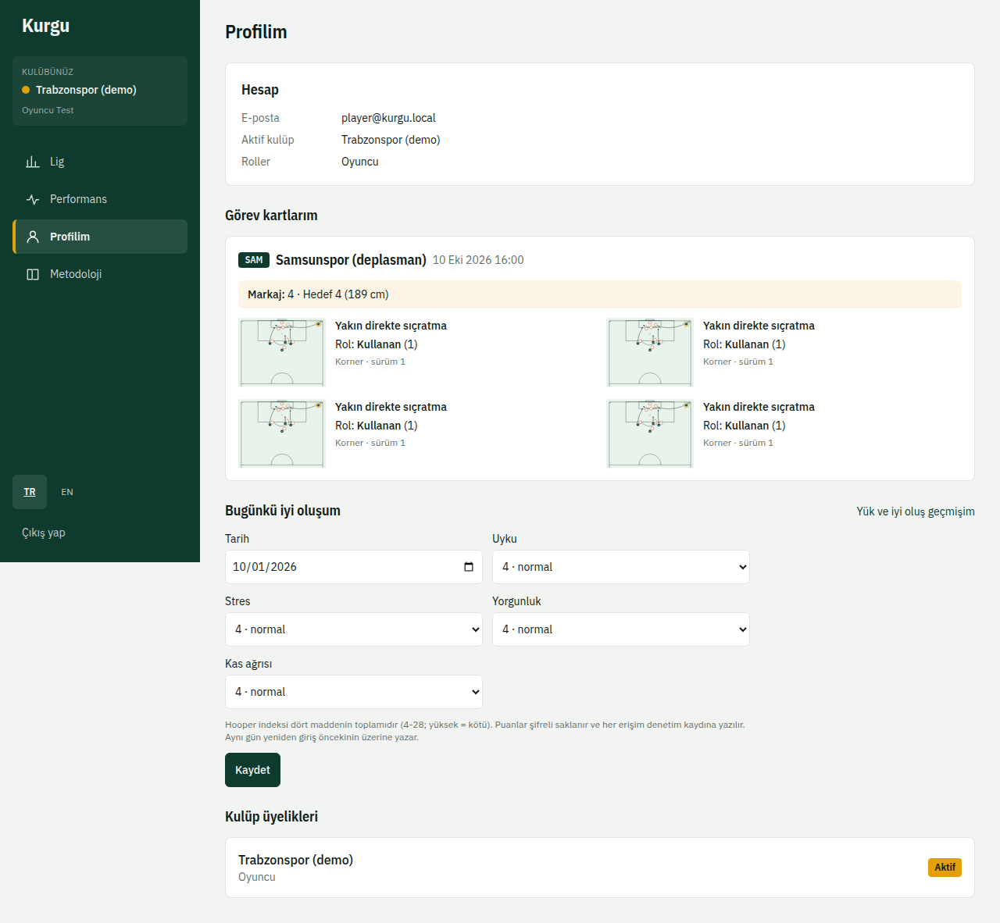
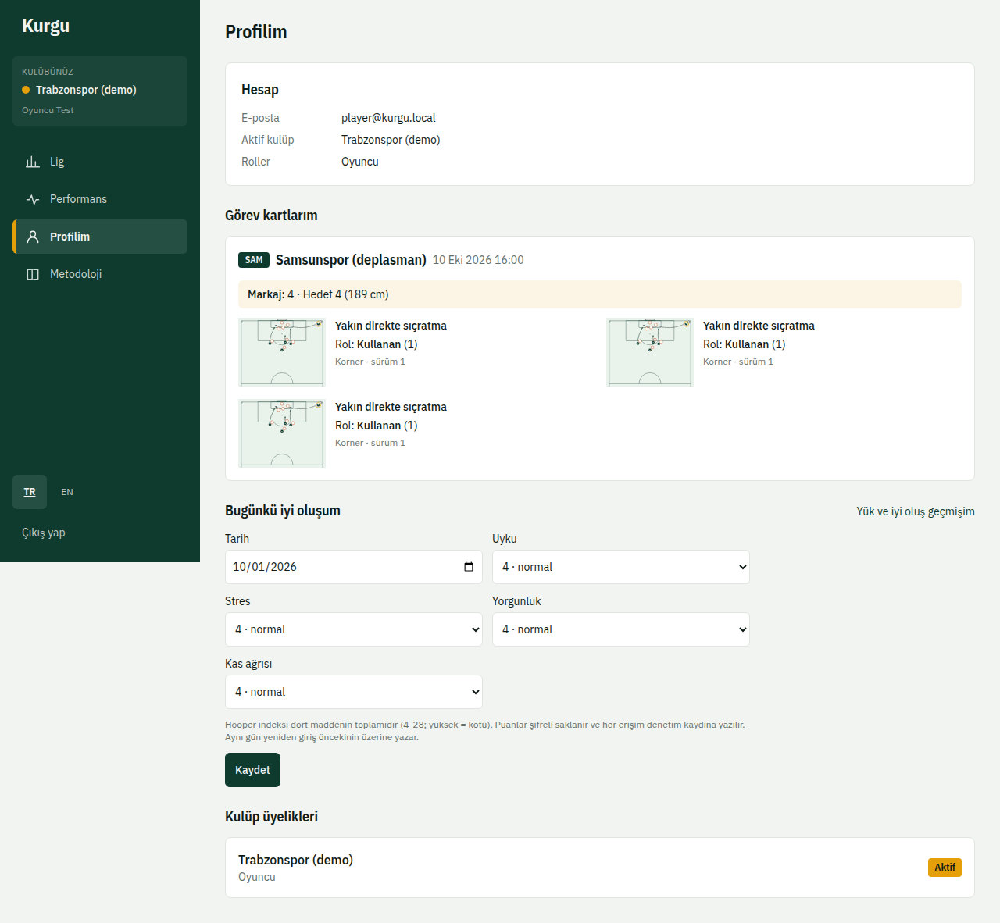
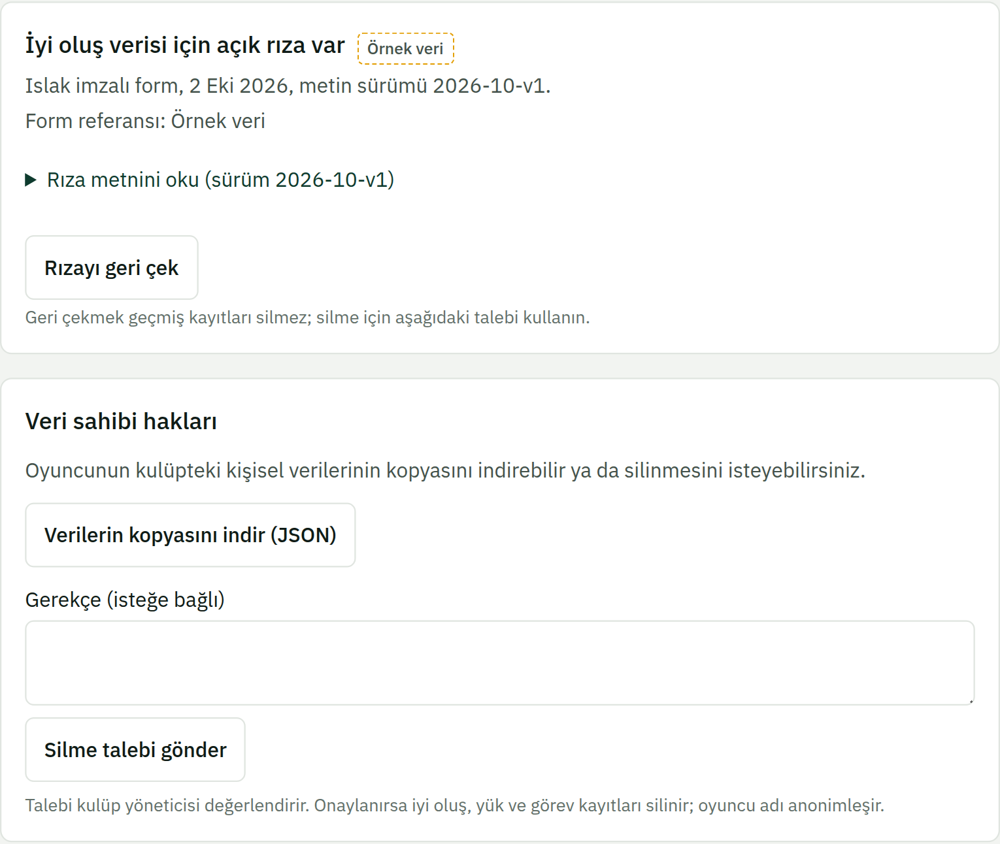

# 7. Oyuncular

Oyuncu hesabıyla girdiğinizde **Profilim** (`/me`) sayfası açılır.

## Görev kartlarım
Sıradaki maçta size atanan duran top görevleri burada kart olarak görünür: rutin, rolünüz ve sahadaki konumunuz.

## Bugünkü iyi oluşum
Sabah uyku, stres, yorgunluk ve kas ağrısı puanlarınızı girin. Bu bilgiler şifreli saklanır; yalnızca performans ve sağlık ekibi görür.

## Rıza ve verileriniz
**Açık rıza** ve **Veri sahibi hakları** bölümlerinde:

- Rıza metnini okuyup **Okudum, rıza veriyorum** ile onay verebilirsiniz. Rıza vermezseniz iyi oluş girişi yapılamaz; diğer özellikler çalışır.
- **Rızayı geri çek** ile rızanızı istediğiniz an geri alabilirsiniz. Yeni giriş yapılamaz; eski kayıtlar saklama süresi dolunca silinir.
- **Verilerin kopyasını indir (JSON)** ile hakkınızda tutulan kayıtları indirebilirsiniz.
- **Silme talebi gönder** ile verilerinizin silinmesini isteyebilirsiniz. Talep kulüp yöneticisine gider; sonucu bu bölümde görürsünüz.

