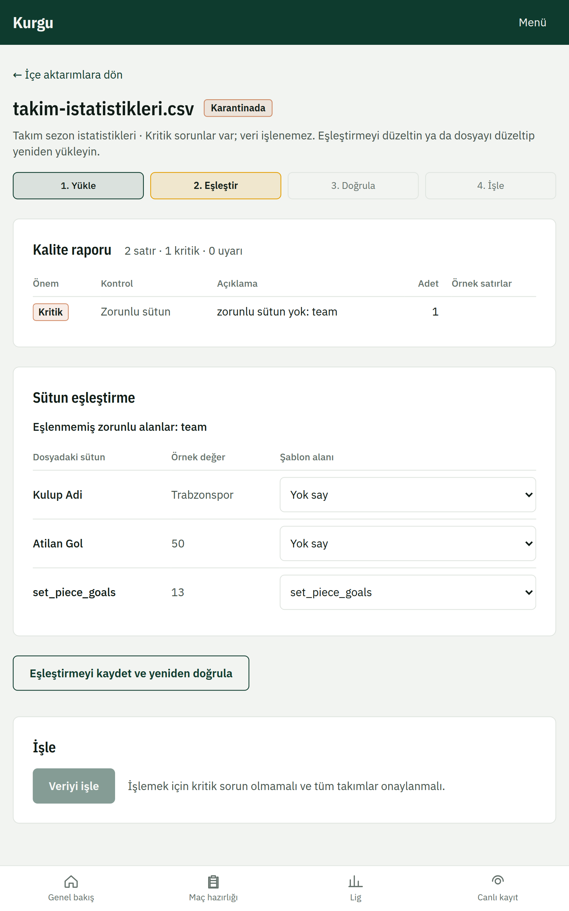
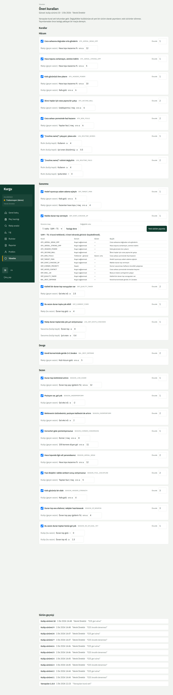
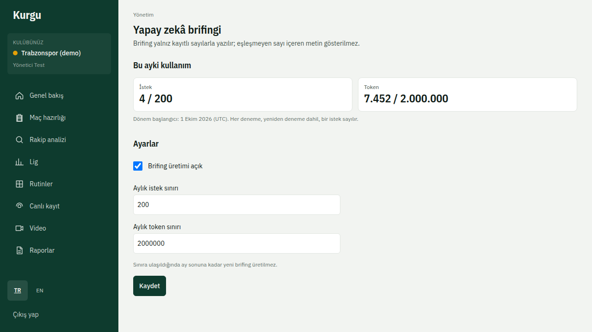
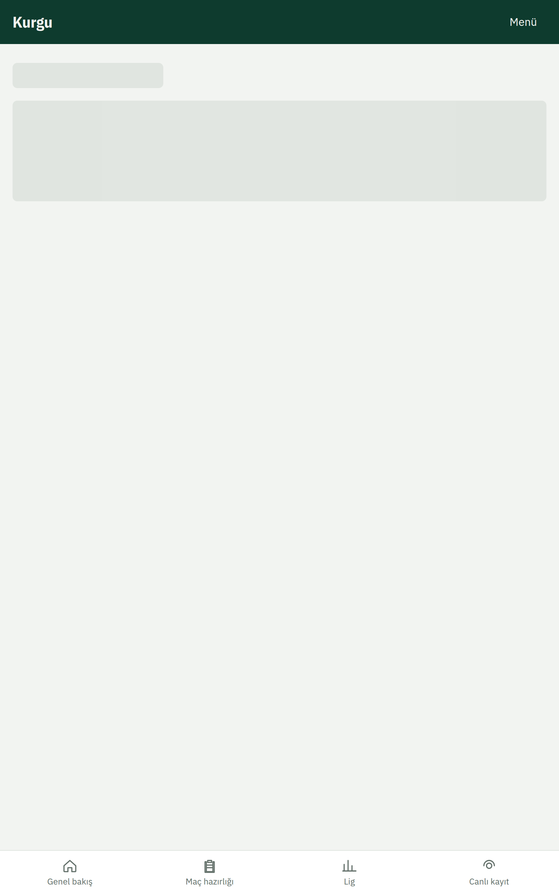

# 8. Yönetim

Bu bölüm kulüp yöneticisi içindir. Yönetim sayfalarına girerken iki adımlı doğrulama istenir.

## Veri içe aktarma
**Yönetim → İçe aktarma** (`/admin/imports`) kulübünüzün kendi duran top kayıtlarını CSV ya da Excel dosyasından alır.

1. Dosyayı seçip **Yükle ve doğrula**. Dosya önce **Karantinada** bekler.
2. Sütun eşleştirmesini ve takım adlarını kontrol edin, gerekirse düzeltip **Eşleştirmeyi kaydet ve yeniden doğrula**.
3. Hata kalmadığında **Veriyi işle**. Durum **İşlendi** olur ve metrikler güncellenir. Kulübün kendi verisi, aynı metrik için lig verisinin yerine geçer.

Excel dosyası değilmiş gibi görünen ya da aşırı büyük açılan dosyalar güvenlik nedeniyle reddedilir.

## Öneri kuralları
**Yönetim → Kurallar** (`/admin/rules`) önerileri üreten kuralları düzenlemek içindir. Değişikliği **Taslağı dene** ile önce örnek maçlarda deneyin; sonuç beğenilirse **Yeni sürüm yayımla**. Eski sürümler geçmişte kalır.

## Yapay zekâ
**Yönetim → Yapay zekâ brifingi** (`/admin/llm`) özelliği açıp kapatır ve aylık istek ve token sınırını belirler. Model ve anahtar sunucu ayarlarındadır; anahtar bu sayfada gösterilmez.

## Kadro
Bkz. [Performans, kadro ve markaj](06-performans-ve-kadro.md#kadro).

## Gizlilik (KVKK)
**Yönetim → Kişisel veriler (KVKK)** (`/admin/privacy`) üç bölümden oluşur:

- **Talepler**: oyuncuların silme taleplerini **Onayla ve sil** ya da **Reddet** ile sonuçlandırın. Onay geri alınamaz.
- **Saklama süreleri**: iyi oluş, antrenman yükü ve denetim kayıtlarının kaç gün saklanacağını girip **Kaydet**. Süresi dolan kayıtlar her gece silinir.
- **Veri envanteri**: hangi kişisel verinin nerede, hangi amaçla tutulduğunun listesi.

## Kullanıcılar
Yeni kullanıcı ekleme ve rol atama şimdilik teknik ekip tarafından yapılır (`docs/runbooks/users-mfa.md`).
